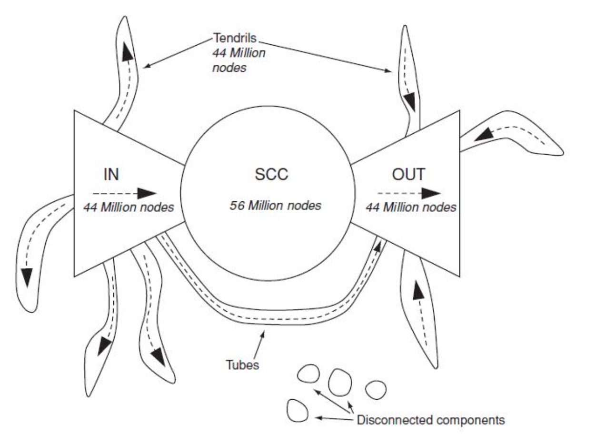
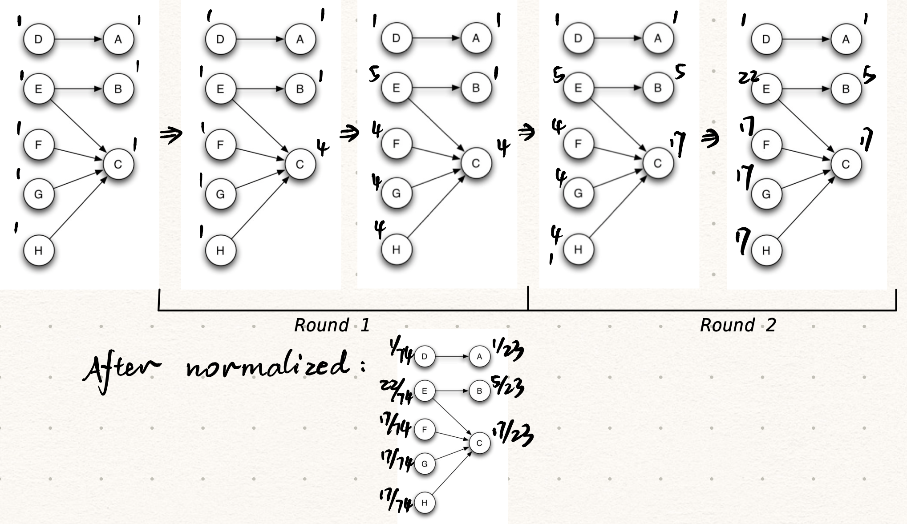

### Chapter 2

> Pivotal Node

Between node `A` and `B`, every shortest route should trespass a node `C`, which is the **pivotal node** of the two.

> (Global) Gatekeeper

Node `X` is a gatekeeper if for some other two nodes `Y` and `Z`, every path from `Y` to `Z` passes through `X`.

> Local Gatekeeper

Node `X` is a local gatekeeper if there are two neighbors, say `Y` and `Z`, that are not connected by an edge. 

> Diameter

The maximum distance between any pair of nodes in the graph.

> Average Distance

The average distance over all pairs of nodes in the graph.

### Chapter 3

> Triadic Closure

Triadic closure is the property among three nodes `A`, `B`, and `C`(representing people, for instance), that if the connections `A-B` and `B-C` exist, there is a tendency for the new connection `A-C` to be formed.

> Strong Triadic Closure Property

We say that a node `A` violates the **Strong Triadic Closure Property** if it has strong ties to two other nodes `B` and `C`, and there is no edge at all (either a strong or weak tie) between `B` and `C`. We say that a node `A` satisfies the **Strong Triadic Closure Property** if it does not violate it.

### Chapter 4

> Affiliation Network

An affiliation network is a bipartite graph that shows which individuals are affiliated with which groups or activities.

People on the left, foci on the right.

### Chapter 5

> Structural Balance Property

For every set of three nodes, if we consider the three edges connecting them, either all three of these edges are labeled + (positive, friendly, etc.), or else exactly one of them is labeled + (negative, hostile, enemy, etc.).

### Chapter 6

> Nash Equilibrium

A strategy to make the sum of payoffs maximum. (Under most situations)

It is actually a mutual-best option, which means no one can benefit from a single changing of strategy.

### Chapter 13

> Strongly Connected Component (SCC)

A strongly connected component (SCC) in a directed graph is a subset of the nodes such that: 

(i) every node in the subset has a path to every other;

(ii) the subset is not part of some larger set with the property that every node can reach every other.

> IN-set and OUT-set

IN: nodes that can reach the giant SCC but cannot be reached from it — i.e., nodes that are “upstream” of it. 

OUT: nodes that can be reached from the giant SCC but cannot reach it — i.e., nodes are “downstream” of it.

> Tendrils

The “tendrils” of the bow-tie consist of:

(a) the nodes reachable from IN that cannot reach the giant SCC;

(b) the nodes that can reach OUT but cannot be reached from the giant SCC. 

### Chapter 14

> Hub-Authority Computation

1. **Authority Update Rule**: For each page p, update auth(p) to be the sum of the hub scores of all pages that point to it.

2. **Hub Update Rule**: For each page p, update hub(p) to be the sum of the authority scores of all pages that it points to.

> Normalization

Divide down each authority score by the sum of all authority scores, and divide down each hub score by the sum of all hub scores. 

> Basic PageRank Update Rule

Each page divides its current PageRank equally across its out-going links, and passes these equal shares to the pages it points to. (If a page has no out-going links, it passes all its current PageRank to itself.) Each page updates its new PageRank to be the sum of the shares it receives.

**Equilibrium**: The numbers should not change after updating.

### Chapter 21

> Epidemic Model

Presuming there are two individuals: Person A $[a, b]$ and Person B $[c, d]$, the condition that disease on A can be acquired by B is that: $c \le b\ \and\ d\ge a\ \and d \ge c$.
